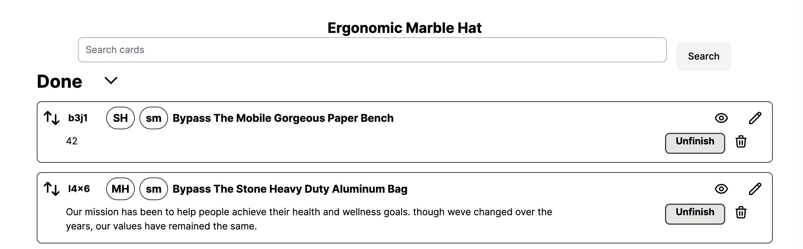

# README

This code base is for use during the [2022 RailsConf Rails 7 Front End Tools](https://railsconf.org/program/workshops#session-1300) workshop.

## Setup

### Preferred setup

In order to run this application, you need SQLite on your machine. The application comes with a pre-seeded SQLite database.

For ease of installation, this application does not specify a Ruby version. It was developed with Ruby 3.1.2, but should run with any version of Ruby 3.0 and up. (Please note that Ruby 3.1 and up is the required and recommended version of Ruby to use with Rails 7.0.x).

In order to get set up, you should do the following

1. Clone and download this repository
2. In the directory for this repo, make sure you are running Rails 3.1 or up
3. run `bundle install`
4. Start your server by running `bin/dev`
5. go to http://localhost:3000/
6. You should see a webpage that looks like a project tracker

### Much less supported Docker setup

There is also a Docker setup. Please note that Noel will be much less
likely to troubleshoot docker issues.

To use Docker:

1. `docker-compose up`
1. Wait....it will take a while before the app is running.
1. Go to http://localhost:3000

You should be able to edit the files normally.

## About the App

The app is a very simple project tracker based on my [Elmer](https://noelrappin.com/tags/elmer/) project. Its data model is simplified and there's no user model or security. The app consists of _projects_ which are made up of _cards_. A card has a size (xl, lg, md, sm, xs) and a status (archived attic unstarted started done).

## How to use this repo

This repo has several different branches, most of which add one piece of functionality to the main branch. Most of the branches are separate, so they do not build on each other, though there are a few cases where there is a branch that extends functionality built in an earlier branch.

The idea is that you can see small changes in isolation and choose to piece them together in your own version of the app.

To use this app, you should move between branches to browse code (you may want to use GitHub to browse other branches or even download the repo twice, once to browse and once to work on)/.

I've tried to put a lot of base info in the `plain_old_ruby` branch to minimize change between branches, but there still may be things that require a restart of the server or the docker container as you change branches.

The `main` branch is pretty much just what you get from running `rails new . -a propshaft j importmap -d sqlite3 -c tailwind --skip-test`+ data models and view files and support gems. Running this branch gives you the basic, no JavaScript version of the app.

If you hit `http://localhost:3000`, `http://localhost:3000/projects`, or `http://localhost:3000/projects/1`, they should all look something like this:

Please note that the data is all generated via Faker and a rake task in `lib/tasks/sample_data.rake`, run `rake tracker:clear_and_create` to completely delete the data and generate a new project's worth of data

The follow up branches, more or less in the order of how complicated the code is:

| Branch | Uses | Description
| --- | --- | -- |
|`edit_name_and_description`| turbo frames | Allows you to edit the name and description of a card inline without changing pages. |
|`detail_show_hide`| stimulus | Allows you to show and hide the details of a card using stimulus and CSS. |
|`add_new_card`| turbo stream | Allows you to add a new card in the page and update the page. |
|`forward_and_back`| turbo stream | Move cards forward to the next status and back to a previous one without an entire page refresh. |
|`status_show_hide`| stimulus | Show and hide an entire status, including changing the chevron icon. |
|`broadcast_new_card`| actioncable | When a new card is added, broadcast that change to other browsers that might be open. |
|`search` | turbo frames | Search for cards based on text without a full page refresh. |
|`search_with_autosubmit`| stimulus | Autosubmit the search while you type. |
|`drag_and_drop`| stimulus and sortable.js| Drag and drop cards to change their order. |
|`size_and_person`| stimulus and turbo frames| Click and get a dropdown list of sizes and attached people without a page update. |
|`search_with_recent_searches`| stimulus kredis turbo stream actioncable | Augment the search with a list of recent searches that you can choose.
